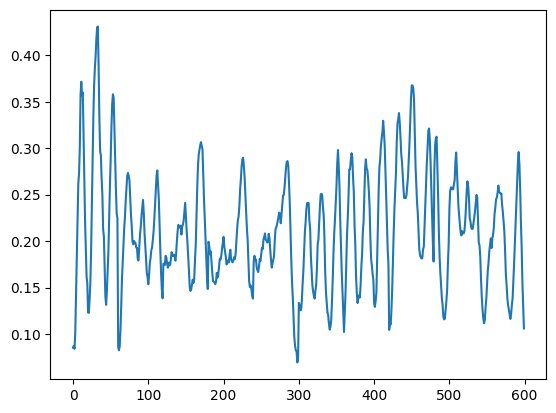

# a quick and dirty start for six axis

* Put video and files in source folder to match similar format to example files
    * Including create a txt file containing intended sequences
* Run through source_to_extracted.ipynb notebook. Set the video_file variable to match the video
* Run through extracted_to_dataset.ipynb notebook
* Run through train_extracted.ipynb and train for indeterminate period of time
* Test the model against a different video with test_model.ipynb. Set the timestamp variables to choose the start time. It could be quicker, it's not really batching efficiently.

### Other stuff
* the data loader is bad and inefficient
* i don't know the specific ram requirements to train, but it was tested against 128gb ram, and 2 x 24GB cuda cards
* no requirements.txt yet, but there's nothing exotic needed
* in this format, this process is not fully tested yet. It's assembled from notebooks I had across multiple devices, hence some of the duplication of files.
* it should be trained against multiple scenes (run through the first 2 notebooks multiple times for multiple files). If you try train against a subtle or inaccurate scene, it will produce bad results.
* It's slow, and doesn't output scripts, only the predictions. I don't think model is going to get better results than [silver lamp](https://github.com/herpaderpapotato/silver-lamp) without a lot of rework or a dedicated model-per-position workflow which is underwhelming.

This is the vertical axis plot on a 10 second segment test after ~2 hours of training.

Also, anytime I use github copilot and specify a video file name of an actual explicit scene in my code when I'm testing, github copilot just refuses to help generate ANY code and so I have to go change the video file name in the code to input.mp4 while writing the code. It didn't use to be such a prude, I don't need you judging me github copilot!